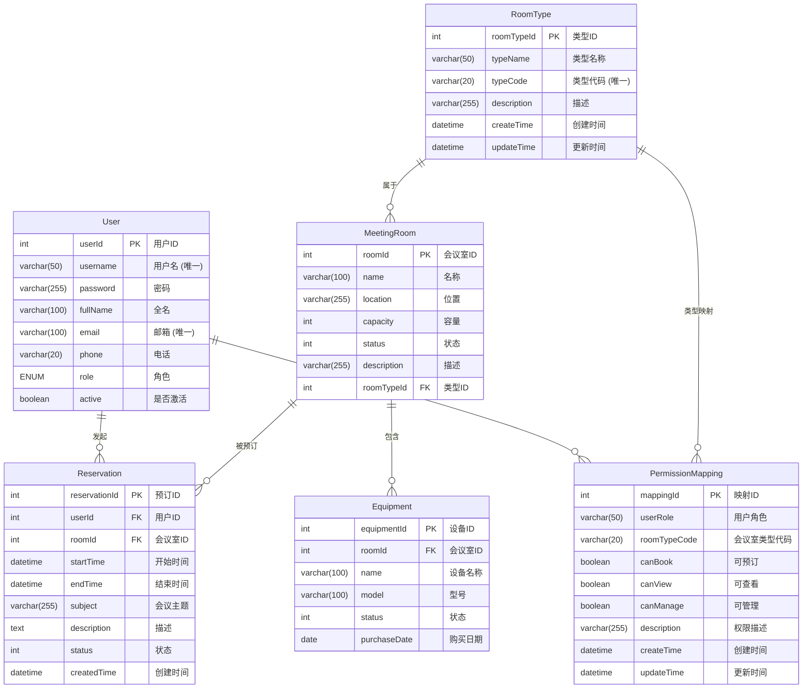

# 会议室预订系统数据库说明文档

## 1. 概述

本文档详细描述了会议室预订管理系统的数据库结构。该数据库旨在有效管理用户信息、会议室资源、设备以及相关的预订流程。系统采用关系型数据库模型，通过外键约束保证数据的一致性和完整性。系统还实现了基于字段映射的权限管理机制，通过用户角色和会议室类型的组合来控制访问权限。

**数据库名**: `conference_room_booking`
**字符集**: `utf8mb4`
**存储引擎**: `InnoDB`

## 2. 实体关系图 (E-R Diagram)

## 3. 表结构详情

### 3.1 `User` (用户表)

存储系统的所有用户信息，包括登录凭证和个人信息。

| 字段名 | 数据类型 | 约束 | 默认值 | 注释 |
|---|---|---|---|---|
| `userId` | `INT` | `PRIMARY KEY`, `AUTO_INCREMENT` | | 用户唯一标识符 |
| `username` | `VARCHAR(50)` | `NOT NULL`, `UNIQUE` | | 用户名，用于登录 |
| `password` | `VARCHAR(255)` | `NOT NULL` | | 加密后的用户密码 |
| `fullName` | `VARCHAR(100)` | `NULL` | `NULL` | 用户全名 |
| `email` | `VARCHAR(100)` | `UNIQUE`, `NULL` | `NULL` | 用户的电子邮件地址 |
| `phone` | `VARCHAR(20)` | `NULL` | `NULL` | 用户的联系电话 |
| `role` | `ENUM('NORMAL_EMPLOYEE', 'LEADER', 'SYSTEM_ADMIN')` | `NOT NULL` | | 用户角色 (`NORMAL_EMPLOYEE`: 普通员工, `LEADER`: 领导, `SYSTEM_ADMIN`: 系统管理员) |
| `active` | `BOOLEAN` | `NOT NULL` | `TRUE` | 账户是否被激活 (1: 激活, 0: 未激活) |

---

### 3.2 `RoomType` (会议室类型表)

定义会议室的分类，例如基础会议室、高级会议室、VIP会议室等。

| 字段名 | 数据类型 | 约束 | 默认值 | 注释 |
|---|---|---|---|---|
| `roomTypeId` | `INT` | `PRIMARY KEY`, `AUTO_INCREMENT` | | 类型唯一标识符 |
| `typeName` | `VARCHAR(50)` | `NOT NULL` | | 类型名称 |
| `typeCode` | `VARCHAR(20)` | `NOT NULL`, `UNIQUE` | | 类型代码，用于程序内部识别 |
| `description`| `VARCHAR(255)`| `NULL` | `NULL` | 类型的详细描述 |
| `createTime` | `DATETIME` | `NOT NULL` | `CURRENT_TIMESTAMP` | 记录创建时间 |
| `updateTime` | `DATETIME` | `NOT NULL` | `CURRENT_TIMESTAMP` on update | 记录最后更新时间 |

---

### 3.3 `MeetingRoom` (会议室表)

存储所有会议室的详细信息。

| 字段名 | 数据类型 | 约束 | 默认值 | 注释 |
|---|---|---|---|---|
| `roomId` | `INT` | `PRIMARY KEY`, `AUTO_INCREMENT` | | 会议室唯一标识符 |
| `name` | `VARCHAR(100)`| `NOT NULL` | | 会议室名称 |
| `location` | `VARCHAR(255)`| `NULL` | `NULL` | 会议室的具体位置 |
| `capacity` | `INT` | `NULL` | `NULL` | 会议室的容纳人数 |
| `status` | `INT` | `NULL` | `NULL` | 会议室状态 (1: 可用, 2: 维修中, 3: 已停用) |
| `description`| `VARCHAR(255)`| `NULL` | `NULL` | 会议室的描述信息 |
| `roomTypeId` | `INT` | `FOREIGN KEY` (references `RoomType`) | `NULL` | 关联的会议室类型ID |

---

### 3.4 `Equipment` (设备表)

存储会议室内部署的设备信息。

| 字段名 | 数据类型 | 约束 | 默认值 | 注释 |
|---|---|---|---|---|
| `equipmentId`| `INT` | `PRIMARY KEY`, `AUTO_INCREMENT` | | 设备唯一标识符 |
| `roomId` | `INT` | `FOREIGN KEY` (references `MeetingRoom`) | `NULL` | 设备所属的会议室ID |
| `name` | `VARCHAR(100)`| `NOT NULL` | | 设备名称（如投影仪、白板） |
| `model` | `VARCHAR(100)`| `NULL` | `NULL` | 设备的型号 |
| `status` | `INT` | `NULL` | `NULL` | 设备状态 (1: 正常, 2: 维修中, 3: 报废) |
| `purchaseDate`| `DATE` | `NULL` | `NULL` | 设备的购买日期 |

---

### 3.5 `Reservation` (预订表)

核心业务表，存储所有会议室的预订记录。

| 字段名 | 数据类型 | 约束 | 默认值 | 注释 |
|---|---|---|---|---|
| `reservationId`| `INT` | `PRIMARY KEY`, `AUTO_INCREMENT` | | 预订记录的唯一标识符 |
| `userId` | `INT` | `FOREIGN KEY` (references `User`) | `NULL` | 发起预订的用户的ID |
| `roomId` | `INT` | `FOREIGN KEY` (references `MeetingRoom`) | `NULL` | 被预订的会议室的ID |
| `startTime` | `DATETIME` | `NOT NULL` | | 会议开始时间 |
| `endTime` | `DATETIME` | `NOT NULL` | | 会议结束时间 |
| `subject` | `VARCHAR(255)`| `NULL` | `NULL` | 会议主题 |
| `description`| `TEXT` | `NULL` | `NULL` | 会议的详细描述或备注 |
| `status` | `INT` | `NULL` | `NULL` | 预订状态 (1: 已确认, 2: 已取消, 3: 进行中, 4: 已完成) |
| `createdTime`| `DATETIME` | `NOT NULL` | `CURRENT_TIMESTAMP` | 预订记录的创建时间 |

---

### 3.6 `PermissionMapping` (权限映射表)

存储用户角色和会议室类型的权限映射关系，实现基于字段映射的权限控制。

| 字段名 | 数据类型 | 约束 | 默认值 | 注释 |
|---|---|---|---|---|
| `mappingId` | `INT` | `PRIMARY KEY`, `AUTO_INCREMENT` | | 权限映射唯一标识符 |
| `userRole` | `VARCHAR(50)` | `NOT NULL` | | 用户角色 (NORMAL_EMPLOYEE, LEADER, SYSTEM_ADMIN) |
| `roomTypeCode` | `VARCHAR(20)` | `NOT NULL` | | 会议室类型代码 |
| `canBook` | `BOOLEAN` | `NOT NULL` | `FALSE` | 是否可以预订该类型会议室 |
| `canView` | `BOOLEAN` | `NOT NULL` | `FALSE` | 是否可以查看该类型会议室 |
| `canManage` | `BOOLEAN` | `NOT NULL` | `FALSE` | 是否可以管理该类型会议室 |
| `description` | `VARCHAR(255)` | `NULL` | `NULL` | 权限配置的描述信息 |
| `createTime` | `DATETIME` | `NOT NULL` | `CURRENT_TIMESTAMP` | 记录创建时间 |
| `updateTime` | `DATETIME` | `NOT NULL` | `CURRENT_TIMESTAMP` on update | 记录最后更新时间 |

**索引**:
- `UNIQUE KEY uk_user_role_room_type (userRole, roomTypeCode)` - 确保每个角色对每种会议室类型只有一条权限记录
- `INDEX idx_user_role (userRole)` - 优化按用户角色查询权限
- `INDEX idx_room_type_code (roomTypeCode)` - 优化按会议室类型查询权限

## 4. 权限系统说明

### 4.1 权限模型

系统采用基于字段映射的权限模型，通过以下三个维度控制访问权限：

1. **用户角色** (`User.role`): NORMAL_EMPLOYEE, LEADER, SYSTEM_ADMIN
2. **会议室类型** (`RoomType.typeCode`): BASIC, PREMIUM, VIP
3. **权限类型**: 查看(canView), 预订(canBook), 管理(canManage)

### 4.2 默认权限配置

| 用户角色 | 基础会议室 | 高级会议室 | VIP会议室 |
|---------|-----------|-----------|-----------|
| SYSTEM_ADMIN | 完全管理 | 完全管理 | 完全管理 |
| LEADER | 可预订查看 | 可预订查看 | 可预订查看 |
| NORMAL_EMPLOYEE | 可预订查看 | 仅查看 | 无权限 |

### 4.3 权限检查流程

1. **会议室列表加载**: 只显示用户有权限查看的会议室
2. **预订按钮状态**: 根据用户权限和会议室状态动态启用/禁用
3. **预订操作验证**: 在预订前再次检查用户权限
4. **管理权限检查**: 在管理操作前验证用户权限

## 5. 数据完整性约束

### 5.1 外键约束

- `MeetingRoom.roomTypeId` → `RoomType.roomTypeId`
- `MeetingRoom.roomId` → `Equipment.roomId`
- `User.userId` → `Reservation.userId`
- `MeetingRoom.roomId` → `Reservation.roomId`

### 5.2 唯一性约束

- `User.username` - 用户名唯一
- `User.email` - 邮箱唯一
- `RoomType.typeCode` - 会议室类型代码唯一
- `PermissionMapping(userRole, roomTypeCode)` - 角色类型组合唯一

### 5.3 检查约束

- `User.role` - 只能是预定义的角色值
- `MeetingRoom.status` - 会议室状态值范围
- `Equipment.status` - 设备状态值范围
- `Reservation.status` - 预订状态值范围

## 6. 性能优化建议

### 6.1 索引策略

- 为频繁查询的字段添加索引
- 为外键关系添加索引
- 为权限检查查询优化索引

### 6.2 查询优化

- 使用适当的JOIN查询
- 避免N+1查询问题
- 考虑使用视图简化复杂查询

### 6.3 数据维护

- 定期清理过期数据
- 监控表大小和查询性能
- 定期备份权限配置数据